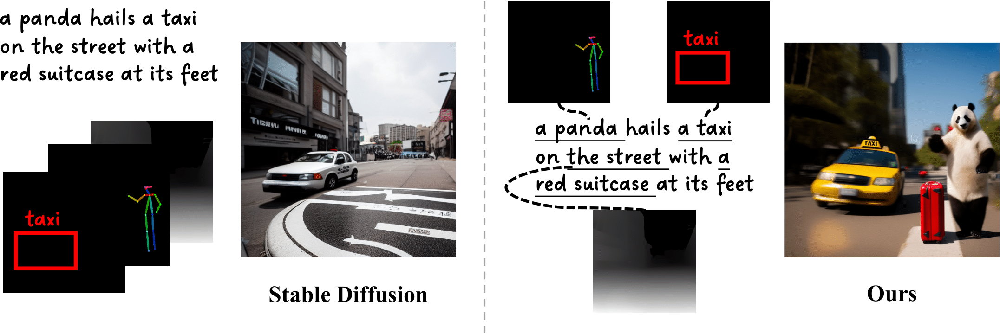
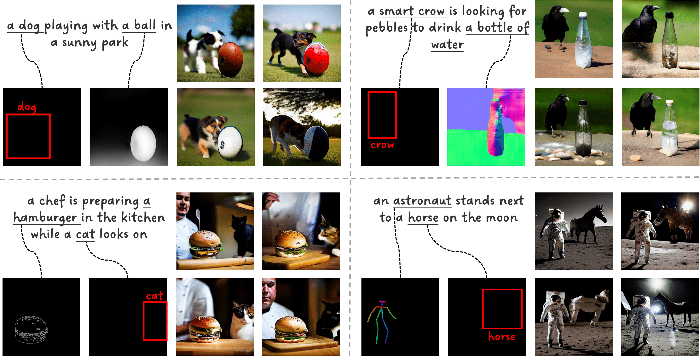

# Decompose and Realign: Tackling Condition Misalignment in Text-to-Image Diffusion Models

[Luozhou Wang](https://wileewang.github.io/)$^{{\*}}$, [Guibao Shen]()$^{{\*}}$, [Wenhang Ge](https://g3956.github.io/wenhangge.github.io/), [Guangyong Chen](https://guangyongchen.github.io/), [Yijun Li](https://yijunmaverick.github.io/), [Yingcong Chen](https://www.yingcong.me)$^{\**}$

HKUST(GZ), HKUST, ZJL, ZJU, Adobe.

${\*}$: Equal contribution.
\**: Corresponding author.

<a href="https://arxiv.org/abs/2306.14408"></a>
<a href="https://a-bigbao.github.io/D-R/"></a> 
<!--
<a href="https://youtu.be/9EWs2IX4cus"></a> 
[](https://huggingface.co/spaces/hysts/Attend-and-Excite)
[](https://replicate.com/daanelson/attend-and-excite)
-->

## 🎏 Abstract

Text-to-image diffusion models have advanced towards more controllable generation via supporting various additional conditions (e.g., depth map, bounding box) beyond text. However, these models are learned based on the premise of perfect alignment between the text and extra conditions.

<details><summary>CLICK for the full abstract</summary>

> Text-to-image diffusion models have advanced towards more controllable generation via supporting various additional conditions (e.g., depth map, bounding box) beyond text. However, these models are learned based on the premise of perfect alignment between the text and extra conditions. If this alignment is not satisfied, the final output could be either dominated by one condition, or ambiguity may arise, failing to meet user expectations. To address this issue, we present a training-free approach called "Decompose and Realign" to further improve the controllability of existing models when provided with partially aligned conditions. The "Decompose" phase separates conditions based on pair relationships, computing the result individually for each pair. This ensures that each pair no longer has conflicting conditions. The "Realign" phase aligns these independently calculated results via a cross-attention mechanism to avoid new conflicts when combining them back. Both qualitative and quantitative results demonstrate the effectiveness of our approach in handling unaligned conditions, which performs favorably against recent methods and more importantly adds flexibility to the controllable image generation process.

</details>

<div align=center>


llustration of our proposed Decompose and Realign showcasing the ability to handle the misalignment between conditions
for controllable generation task
</div>


## 🔧 Quick Start
### Environment
Our code relies also on Hugging Face's [diffusers](https://github.com/huggingface/diffusers) library. 

```
pip install diffusers, transformers, pytorch
```


### Prepare input conditions


To generate an image, you need to organize the input conditions as a json
```
inputs = {
        "text": 
            {
                "caption": "A panda hails a taxi on the street with a red suitcase at its feet", 
                "index": [10,11,12], 
                "control_info": 10,
                "cfg":7,
            }, 
        "pose": 
            {
                "index": [1, 2], 
                "control_info": "resources/pose.png",
                "cfg":5
            }, 
        "bbox": 
            {
                "index": [4, 5], 
                "control_info": [[0.1, 0.5, 0.6, 0.8]],
                "cfg":4
            }, 
        "depth": 
            {
                "index": [6, 7, 8], 
                "control_info": "resources/depth.png",
                "cfg":2
            }
        }
```
Notes:

- `text` is always required during generation as a unified signal, and the `index` indicate which text tokens you want to enhance with our **Confidence Focusing Operation** and **Concentration Refinement Operation** which is introduced in the Sec 3.3 of our paper and implemented via [code]() 
- You may run multiple seeds by passing a list of seeds. For example, `--seeds [0,1,2,3]`.
- If you do not provide a list of which token indices to alter using `--token_indices`, we will split the text according to the Stable Diffusion's tokenizer and display the index of each token. You will then be able to input which indices you wish to alter.
- If you wish to run the standard Stable Diffusion model without Attend-and-Excite, you can do so by passing `--run_standard_sd True`.
- All parameters are defined in `config.py` and are set to their defaults according to the official paper.

All generated images will be saved to the path `"{config.output_path}/{prompt}"`. We will also save a grid of all images (in the case of multiple seeds) under `config.output_path`.


<div align=center>
   
  
Examples of complex scenes, seamlessly integrating with a variety of controller mechanism.
</div>


## 🚧 Todo

- [x] Release the inference code
- [x] Release the guidance documents
- [ ] Release the gradio demo
- [ ] Release the extensions for Stable Diffusion WebUI


## 📍 Citation 
```
@misc{wang2023decompose,
      title={Decompose and Realign: Tackling Condition Misalignment in Text-to-Image Diffusion Models}, 
      author={Luozhou Wang and Guibao Shen and Yijun Li and Ying-cong Chen},
      year={2023},
      eprint={2306.14408},
      archivePrefix={arXiv},
      primaryClass={cs.CV}
}
```

## Acknowledgements 
This code is builds on the code from the [diffusers](https://github.com/huggingface/diffusers) library as well as the [Prompt-to-Prompt](https://github.com/google/prompt-to-prompt/) codebase.

